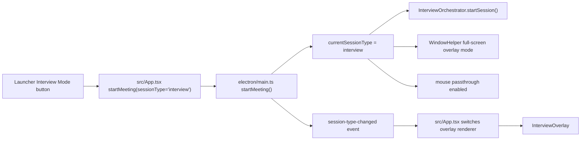
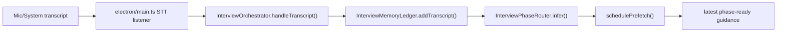

# Interview Mode Feature Presentation v3

## Purpose

This document explains what was added in the new interview mode, how it is expected to behave in an ideal run, how you can generate that behavior during testing right now, and which part of the codebase owns each part of the flow so future requests can be targeted quickly.

This is the "how the system actually works today" presentation, not just the original plan.

---

## What Was Added

### 1. A real interview session type

Interview mode is now a first-class session type, not a prompt tweak.

What changed:

- launcher can start an `Interview Mode` meeting
- meeting startup now carries `sessionType: "interview"`
- overlay rendering branches between:
  - general overlay
  - interview overlay
- interview mode exits independently from the meeting through a kill switch

Main ownership:

- `src/components/Launcher.tsx`
- `src/App.tsx`
- `electron/main.ts`

### 2. A dedicated full-screen interview overlay

Interview mode no longer uses the generic chat-shaped overlay.

It now renders a full-screen interview layout with:

- `Top Strip`
- `Main Center`
- `Code Panel`
- `Side Notes Rail`
- temporary `Control Strip`

Main ownership:

- `src/components/interview/InterviewOverlay.tsx`
- `src/components/interview/InterviewTopStrip.tsx`
- `src/components/interview/InterviewMainPanel.tsx`
- `src/components/interview/InterviewCodePanel.tsx`
- `src/components/interview/InterviewNotesRail.tsx`
- `src/components/interview/InterviewControlStrip.tsx`
- `src/index.css`
- `electron/WindowHelper.ts`

### 3. Interview-specific state model

Interview mode now keeps structured interview memory instead of depending only on a rolling transcript.

Tracked state includes:

- current phase
- phase confidence
- manual phase override
- problem statement
- constraints
- examples
- open questions
- approach summary
- pinned facts
- thought notes
- quick questions
- requirement changes
- current code snapshot
- latest generated overlay payload
- main-panel scroll offset
- screen freshness
- control strip visibility

Main ownership:

- `electron/interview/types.ts`
- `electron/interview/InterviewMemoryLedger.ts`

### 4. Smart phase routing

Interview mode auto-detects the likely phase from transcript and known state, with manual override on top.

Current phase set:

- `p2_clarify`
- `p3_approach`
- `p4_code`
- `p5_test`
- `p6_close`

Main ownership:

- `electron/interview/InterviewPhaseRouter.ts`
- `electron/interview/InterviewOrchestrator.ts`

### 5. `NEXT` and `SYNC` behavior

`Cmd+Enter` is the main action.

Current `NEXT` behavior:

- serve prefetched content when available
- generate if no valid buffer exists
- expand the already visible script if nothing materially changed

`Cmd+Shift+Enter` is the screen-sync action.

Current `SYNC` behavior:

- capture screenshot
- run interview-specific extraction
- refresh interview memory
- show a short-lived control strip
- if pressed again during that control-strip window, cycle the target phase

Main ownership:

- `electron/interview/InterviewOrchestrator.ts`
- `electron/interview/InterviewPrefetchBuffer.ts`
- `electron/main.ts`

### 6. Interview vision and diff support

Interview mode can now use screen context for:

- pasted problem statements
- visible code
- requirement changes
- dry run inputs
- likely mistakes

When code changes are visible, the system can show a diff-style code panel.

Main ownership:

- `electron/interview/InterviewVisionSync.ts`
- `electron/interview/InterviewDiffEngine.ts`
- `electron/interview/InterviewPrompts.ts`

### 7. Phase-specific generators

Interview generation is split by phase.

Generators added:

- clarification generator
- approach generator
- coding generator
- testing generator
- closing generator

Main ownership:

- `electron/interview/generators/Phase2ClarificationGenerator.ts`
- `electron/interview/generators/Phase3ApproachGenerator.ts`
- `electron/interview/generators/Phase4CodingGenerator.ts`
- `electron/interview/generators/Phase5TestingGenerator.ts`
- `electron/interview/generators/Phase6ClosingGenerator.ts`

### 8. Interview shortcut system

Primary shortcuts:

- `Cmd+Enter` -> `NEXT`
- `Cmd+Shift+Enter` -> `SYNC`

Optional interview shortcuts:

- `Cmd+Shift+Left` -> phase previous
- `Cmd+Shift+Right` -> phase next
- `Cmd+Shift+Up` -> main scroll up
- `Cmd+Shift+Down` -> main scroll down
- kill switch is bindable but has no default accelerator

Important behavior:

- phase previous/next are disabled by default
- interview scroll shortcuts are enabled by default
- kill switch exists in settings and UI, but is not hard-bound by default

Main ownership:

- `electron/services/KeybindManager.ts`
- `src/hooks/useShortcuts.ts`
- `src/components/SettingsOverlay.tsx`
- `electron/main.ts`

### 9. Reliability and replay layer

Added deterministic assets so the feature can be tested without only relying on live interviews.

Added:

- synthetic transcript fixtures
- mocked screen-analysis fixtures
- golden payload fixtures
- transcript replay harness
- focused interview tests

Main ownership:

- `electron/interview/__fixtures__/syntheticInterview.ts`
- `electron/interview/__fixtures__/screenAnalysisFixtures.ts`
- `electron/interview/__fixtures__/goldenPayloads.ts`
- `electron/interview/InterviewReplayHarness.ts`
- `electron/interview/__tests__/InterviewReplayHarness.test.ts`
- `electron/interview/__tests__/InterviewDiffEngine.test.ts`
- `electron/interview/__tests__/InterviewMemoryLedger.test.ts`
- `electron/interview/__tests__/InterviewKeybinds.test.ts`

---

## The Core User Experience

### What the user sees

At runtime the user gets:

- a dedicated interview overlay
- a big main reading lane with exact lines to say
- a code lane with code plus narration
- side notes that hold:
  - what to think
  - what is pinned
  - what quick interruption to keep ready

### What the user mostly presses

Normal interview use should mainly be:

- `Cmd+Enter`
- `Cmd+Shift+Enter`

Everything else is either:

- optional
- fallback
- manually enabled in settings

### What is intentionally not automatic

Some things remain explicit on purpose:

- screenshot analysis only happens on `SYNC`
- direct phase stepping is optional
- kill switch has no default accelerator
- model choice still comes from dashboard/settings and is not hardcoded by interview mode

---

## Ideal Scenario: End-to-End Usage

This is the ideal live use case the current implementation is built around.

### Step 0. Before starting

Set up:

- a coding question visible on screen
- microphone access working
- screen capture permissions already granted
- meeting starts from the launcher using `Interview Mode`

Expected result:

- overlay opens in interview layout
- mouse passthrough is on by default
- phase starts at `Clarify`

### Step 1. Problem appears

User action:

- press `Cmd+Enter` as soon as the problem is visible

System behavior:

- interview mode starts generating clarification help
- main lane begins filling with:
  - short restatement
  - highest-value clarification questions
  - write-now constraints

Best use:

- do this early, before all verbal details are finished

### Step 2. Interviewer keeps talking

System behavior:

- transcript updates keep flowing into interview memory
- phase router keeps the session in `Clarify`
- prefetch buffer refreshes in the background

User action:

- press `Cmd+Enter` again after important clarifications land

Expected result:

- clarified script refreshes with better questions and more complete framing

### Step 3. Move into approach discussion

Interviewer says something like:

- "what approach would you use?"
- "what is the brute-force solution?"
- "can you optimize this?"

System behavior:

- phase router moves to `Approach`
- `NEXT` now yields approach narration instead of clarification questions

Expected overlay content:

- brute-force explanation
- why it is too slow
- optimized approach
- data structure choice
- time/space complexity
- alignment ask before coding

### Step 4. Start coding

Interviewer says something like:

- "go ahead and code it"
- "implement it in Python"

System behavior:

- phase router moves to `Code`
- coding generator creates:
  - speak-now coding narration
  - write-now checklist
  - code panel content

User action:

- if code is visible on screen and you want the assistant to react to the actual typed code, press `Cmd+Shift+Enter`

Expected result:

- screenshot sync extracts visible code
- code panel updates
- control strip appears briefly

### Step 5. Mid-code change or correction

Possible interviewer prompts:

- "can you do this in one pass?"
- "what if duplicates are allowed?"
- "you have a bug there"
- "explain that helper"

Best user action:

- press `Cmd+Shift+Enter` when the changed code or visible hint matters

System behavior:

- screen analysis extracts code and hints
- diff engine compares old and new code
- coding generator can move into diff-oriented help

Expected overlay content:

- changed-region summary
- code patch/diff
- narration lines for the patch
- likely mistake notes if visible

### Step 6. Dry run and complexity

Interviewer says something like:

- "walk me through an example"
- "what are the edge cases?"
- "what is the time complexity?"

System behavior:

- phase router moves to `Test`
- next generation gives:
  - dry run
  - edge case checklist
  - complexity summary

### Step 7. Close or final follow-up

Interviewer says something like:

- "any questions for me?"
- "thanks, that is all"
- "one last follow-up change"

System behavior:

- phase router moves to `Close`
- next generation gives:
  - quick change response
  - closing line
  - one smart question to ask back if useful

### Step 8. Exit interview mode

User action:

- use the visible `Exit Interview Mode` control
- or bind a kill-switch shortcut in settings and use it

Expected result:

- interview orchestration stops
- meeting remains active
- app returns to standard non-interview overlay behavior

---

## Manual Testing Scenario You Can Run Right Now

This is the easiest full test you can generate today without needing a real interviewer.

## Scenario A: Fast realistic manual test

### Setup

Open three things:

1. Natively launcher
2. a browser tab or doc that shows a simple coding problem
3. a code editor

Recommended sample problem:

- Two Sum

Recommended layout:

- problem statement visible in browser or doc
- editor visible beside it

### Start

1. Open launcher
2. click `Interview Mode`
3. wait for overlay to open full-screen

### Phase 2 test

With the problem visible:

1. press `Cmd+Enter`
2. verify the main lane fills with clarification content
3. speak or read a couple of fake interviewer details aloud into the mic:
   - "there is exactly one answer"
   - "return the indices"
   - "input is not sorted"
4. press `Cmd+Enter` again
5. verify the clarification structure refreshes

### Phase 3 test

Say aloud:

- "what approach would you use"
- "can you optimize it"

Then:

1. press `Cmd+Enter`
2. verify the main lane switches to approach narration

### Phase 4 test

Say aloud:

- "go ahead and code it in Python"

Then:

1. press `Cmd+Enter`
2. verify the code panel appears with Python-oriented help
3. type a partial solution in your editor
4. press `Cmd+Shift+Enter`
5. verify:
   - screen sync occurs
   - code panel updates
   - control strip appears

### Control-strip test

Right after the sync:

1. press `Cmd+Shift+Enter` again
2. verify phase target cycles
3. if you want direct controls, enable `phase prev/next` in settings and test:
   - `Cmd+Shift+Left`
   - `Cmd+Shift+Right`

### Scroll test

1. generate enough content to overflow the main lane
2. press:
   - `Cmd+Shift+Up`
   - `Cmd+Shift+Down`
3. verify only the main lane scrolls

### Testing/closing test

Say aloud:

- "walk me through an example"
- "what is the time complexity"
- "any questions for me"

Then press `Cmd+Enter` after each phase change and verify:

- dry-run content appears
- complexity content appears
- closing content appears

### Kill-switch test

1. use `Exit Interview Mode`
2. verify:
   - meeting is still active
   - interview overlay path ends
   - standard overlay flow resumes

---

## Scenario B: Deterministic code-level validation

If you want confidence without a live UI rehearsal, use the added fixtures and tests.

### Available reliability assets

- synthetic transcript fixture:
  - `electron/interview/__fixtures__/syntheticInterview.ts`
- mocked screen-analysis fixture:
  - `electron/interview/__fixtures__/screenAnalysisFixtures.ts`
- golden payload fixture:
  - `electron/interview/__fixtures__/goldenPayloads.ts`
- replay harness:
  - `electron/interview/InterviewReplayHarness.ts`

### Commands

Run:

```bash
npm run build
npm run build:electron
node --test dist-electron/electron/interview/__tests__/*.test.js
```

What this validates:

- phase progression
- diff behavior
- keybind defaults
- ledger state behavior

---

## Current Trigger Matrix

| Trigger | Where it starts | What it does now |
|---|---|---|
| click `Interview Mode` in launcher | renderer | starts meeting with `sessionType: "interview"` |
| `Cmd+Enter` during interview | global shortcut -> main | routes to `InterviewOrchestrator.handleNext()` |
| `Cmd+Shift+Enter` during interview | global shortcut -> main | routes to `InterviewOrchestrator.handleSyncShortcut()` |
| second `Cmd+Shift+Enter` during control-strip window | global shortcut -> main | cycles manual phase target |
| `Cmd+Shift+Left` | optional global shortcut | moves phase backward |
| `Cmd+Shift+Right` | optional global shortcut | moves phase forward |
| `Cmd+Shift+Up` | global shortcut -> main -> renderer | scrolls main reading lane up |
| `Cmd+Shift+Down` | global shortcut -> main -> renderer | scrolls main reading lane down |
| `Exit Interview Mode` | renderer UI -> IPC | exits interview mode without ending meeting |
| `End Meeting` | renderer UI -> existing meeting flow | ends the meeting entirely |

---

## Initial Wiring Pipeline

## Startup pipeline



## `NEXT` pipeline

```mermaid
flowchart LR
  A["Cmd+Enter"] --> B["KeybindManager"]
  B --> C["electron/main.ts shortcut handler"]
  C --> D["InterviewOrchestrator.handleNext()"]
  D --> E["buffer hit OR generate OR expand current payload"]
  E --> F["InterviewMemoryLedger.applyGeneratedPayload()"]
  F --> G["interview:state-updated"]
  G --> H["InterviewOverlay"]
  H --> I["MainPanel + CodePanel + NotesRail update"]
```



## `SYNC` pipeline

```mermaid
flowchart LR
  A["Cmd+Shift+Enter"] --> B["KeybindManager"]
  B --> C["electron/main.ts shortcut handler"]
  C --> D["InterviewOrchestrator.handleSyncShortcut()"]
  D --> E["takeScreenshot()"]
  E --> F["InterviewVisionSync.analyze()"]
  F --> G["InterviewMemoryLedger.applyScreenAnalysis()"]
  G --> H["InterviewPhaseRouter.infer()"]
  H --> I["prefetch invalidation + control strip"]
  I --> J["interview:state-updated"]
  J --> K["InterviewOverlay refreshes"]
```



## Transcript pipeline



---

## Renderer Section Map

Use this when you want to request UI changes.

### `src/components/interview/InterviewOverlay.tsx`

Owns:

- interview overlay composition
- initial interview-state load
- session subscriptions
- main-lane scroll persistence
- top-level button handlers
- global shortcut scroll handling

Ask for changes here when:

- layout shell needs to change
- section positioning needs to change
- overlay-level behavior needs to change
- interview UI event handling needs to change

### `src/components/interview/InterviewTopStrip.tsx`

Owns:

- phase badge
- confidence badge
- staleness badge
- model/STT labels
- click-through status
- `Next`, `Sync`, `Exit Interview`, `End Meeting` buttons

Ask for changes here when:

- top metadata is wrong
- buttons need to change
- status chips need new fields

### `src/components/interview/InterviewMainPanel.tsx`

Owns:

- main reading lane
- phase hero copy
- `Speak Now`
- `Write Now`
- `Keep Ready`
- `What Changed`
- screen-context summary

Ask for changes here when:

- the main content hierarchy should change
- more or less verbosity should show
- the order of information in the main lane should change

### `src/components/interview/InterviewCodePanel.tsx`

Owns:

- code block rendering
- diff coloring
- narration while typing
- likely mistake display
- change summary above/beside code

Ask for changes here when:

- code is hard to read
- diff rendering should change
- coding narration layout should change
- bug/mistake display should change

### `src/components/interview/InterviewNotesRail.tsx`

Owns:

- thought notes
- pinned facts
- quick interrupts
- shortcut reminders

Ask for changes here when:

- side notes should be prioritized differently
- quick questions should move
- thought notes should be more prominent

### `src/components/interview/InterviewControlStrip.tsx`

Owns:

- temporary post-sync manual phase control strip
- phase label while control strip is active

Ask for changes here when:

- fallback phase control should feel different
- control strip timing or controls should change

---

## Main-Process Section Map

Use this when you want behavior changes rather than pure UI changes.

### `electron/main.ts`

Owns:

- meeting startup with `sessionType`
- routing global shortcuts while interview mode is active
- wiring transcripts into the interview orchestrator
- broadcasting `session-type-changed`
- broadcasting `interview:state-updated`
- exiting interview mode

Ask for changes here when:

- shortcut routing is wrong
- meeting lifecycle behavior is wrong
- overlay mode switching is wrong

### `electron/ipcHandlers.ts`

Owns:

- renderer-accessible interview methods:
  - `get-session-type`
  - `exit-interview-mode`
  - `interview:get-state`
  - `interview:next`
  - `interview:sync`
  - `interview:shift-phase`
  - `interview:set-scroll-offset`

Ask for changes here when:

- renderer cannot reach interview behavior
- a new interview IPC method is needed

### `electron/interview/InterviewOrchestrator.ts`

Owns:

- top-level interview runtime behavior
- transcript handling
- `NEXT`
- `SYNC`
- prefetch scheduling
- manual phase shift
- publish vs expand behavior
- diff application into code payloads

Ask for changes here when:

- next/sync behavior is wrong
- control strip timing is wrong
- content buffering should change
- phase-switch behavior should change

### `electron/interview/InterviewMemoryLedger.ts`

Owns:

- structured interview state
- current snapshot shape
- stored facts and code state
- control strip state
- main scroll state

Ask for changes here when:

- something should be remembered but currently is not
- state is being overwritten incorrectly
- panel replacement rules should change

### `electron/interview/InterviewPhaseRouter.ts`

Owns:

- automatic phase inference
- manual phase stepping order

Ask for changes here when:

- the app moves to the wrong phase
- phase detection should use new transcript signals

### `electron/interview/InterviewVisionSync.ts`

Owns:

- screenshot-to-structured-interview extraction

Ask for changes here when:

- screenshot extraction misses important fields
- new extracted fields are needed

### `electron/interview/InterviewDiffEngine.ts`

Owns:

- line-based diff generation
- change summaries

Ask for changes here when:

- code diffs are not readable enough
- requirement/code delta explanation needs to improve

### `electron/interview/InterviewPrompts.ts`

Owns:

- generator system prompt
- phase prompt builders
- vision prompt builders

Ask for changes here when:

- wording style needs to change globally
- a phase generator needs more explicit instructions
- screenshot extraction prompt needs better guidance

### Generator files

Own:

- phase-specific generation behavior

Files:

- `Phase2ClarificationGenerator.ts`
- `Phase3ApproachGenerator.ts`
- `Phase4CodingGenerator.ts`
- `Phase5TestingGenerator.ts`
- `Phase6ClosingGenerator.ts`

Ask for changes here when:

- one interview phase needs better output without changing all phases

---

## Settings And Shortcut Ownership Map

### `electron/services/KeybindManager.ts`

Owns:

- backend keybind registry
- default interview keybind definitions
- enable/disable persistence

Ask for changes here when:

- a default accelerator needs to change
- a new backend interview shortcut is needed

### `src/hooks/useShortcuts.ts`

Owns:

- frontend shortcut names
- frontend/backend shortcut ID mapping
- default frontend shortcut state

Ask for changes here when:

- settings UI and renderer shortcut names do not match backend

### `src/components/SettingsOverlay.tsx`

Owns:

- visible settings rows for interview shortcuts

Ask for changes here when:

- shortcut controls should be exposed differently in settings

---

## The Fastest Way To Ask For Future Changes

If you want to request a change later, these are the best entry points.

### If the request sounds like this

"Change what appears in the main interview script"

Point to:

- `src/components/interview/InterviewMainPanel.tsx`
- possibly the relevant generator file if the content itself should change

### If the request sounds like this

"The app should move to coding later" or "phase detection is wrong"

Point to:

- `electron/interview/InterviewPhaseRouter.ts`
- `electron/interview/InterviewOrchestrator.ts`

### If the request sounds like this

"`Cmd+Shift+Enter` should do something different"

Point to:

- `electron/main.ts`
- `electron/interview/InterviewOrchestrator.ts`
- `electron/services/KeybindManager.ts`

### If the request sounds like this

"The code panel should show a better diff / mistakes / narration"

Point to:

- `src/components/interview/InterviewCodePanel.tsx`
- `electron/interview/InterviewDiffEngine.ts`
- `electron/interview/generators/Phase4CodingGenerator.ts`

### If the request sounds like this

"I want more things remembered between phases"

Point to:

- `electron/interview/InterviewMemoryLedger.ts`
- `electron/interview/types.ts`

### If the request sounds like this

"The screenshot sync misses something important"

Point to:

- `electron/interview/InterviewVisionSync.ts`
- `electron/interview/InterviewPrompts.ts`

### If the request sounds like this

"I want a new shortcut or different default shortcut"

Point to:

- `electron/services/KeybindManager.ts`
- `src/hooks/useShortcuts.ts`
- `src/components/SettingsOverlay.tsx`

---

## Practical Testing Recommendation

For your current manual testing, the best order is:

1. UI and trigger sanity:
   - start interview mode
   - verify overlay layout
   - verify `NEXT`
   - verify `SYNC`
2. phase progression:
   - clarify -> approach -> code -> test -> close
3. live code sync:
   - type code
   - sync
   - verify code panel updates
4. fallback controls:
   - control strip
   - optional phase prev/next
   - scroll shortcuts
5. exit paths:
   - exit interview mode
   - end meeting
6. deterministic checks:
   - run interview tests

That order will expose most integration bugs quickly.

---

## Bottom Line

The system is now wired as a full interview-specific pipeline:

- launcher starts an interview session
- main process switches runtime mode
- interview orchestrator keeps structured interview memory
- transcript and screen-sync update that memory
- phase routing picks the likely interview phase
- phase-specific generators build structured payloads
- renderer places those payloads into stable interview UI sections
- settings and keybind infrastructure support optional manual controls
- fixtures, replay harness, and tests support deterministic validation

If you want to request future work efficiently, the quickest path is to tell me:

1. which user-visible behavior you want to change
2. which phase it belongs to
3. whether it is:
   - UI
   - shortcut behavior
   - orchestration
   - memory/state
   - vision extraction
   - generator wording

Then I can jump directly to the correct section.
