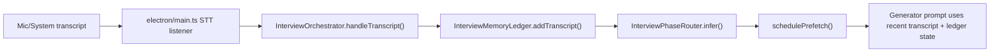
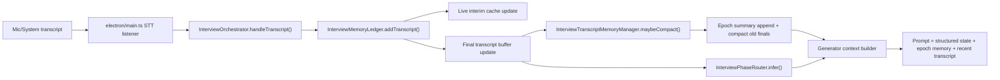

# Interview Memory Feature Plan

This document is a technical implementation plan only.

The goal is to make interview mode reliable for 45-60 minute coding interviews without breaking the current transcript, routing, generation, or overlay flows.

## Problem Summary

Current interview mode keeps all transcript segments in a single in-memory array and hard-caps that array at `500` segments.

Current behavior:

- `InterviewMemoryLedger.addTranscript()` stores every incoming segment, including interim segments.
- Once the transcript array exceeds `500`, the oldest segments are dropped.
- Prompt generation only uses recent transcript slices.
- Older context survives only if it was already promoted into structured state like:
  - `clarifiedFacts`
  - `pinnedFacts`
  - `approachSummary`
  - `openQuestions`
  - `phaseHandoffs`

Why this is risky:

- The `500` cap counts interim and final segments together.
- Streaming STT providers can produce many interim partials.
- A long interview can lose early raw transcript before important details are promoted into structured memory.
- Interview mode does not currently have the older Natively-style epoch compaction that exists in `SessionTracker`.

## Goals

1. Preserve early interview context across long sessions.
2. Keep the current interview UI and shortcut flow working.
3. Avoid changing the meaning of `Next`, `Sync`, phase routing, and renderer subscriptions.
4. Keep prompt inputs small and predictable.
5. Make the first release additive and low-risk.

## Non-Goals

- No DB persistence in v1.
- No meeting-history schema migration in v1.
- No new visible UI dependency in v1.
- No replacement of the structured interview ledger with the general `SessionTracker`.
- No rewrite of the current interview phase model.

## Current Technical Flow



Current important properties:

- Transcript storage is owned by `InterviewMemoryLedger`.
- Routing uses recent transcript slices.
- Prompt building uses:
  - known problem
  - constraints
  - clarified facts
  - open clarification items
  - approach summary
  - requirement changes
  - pinned facts
  - active follow-up
  - current code
  - latest screen analysis
  - recent transcript
  - phase handoffs

Current weakness:

- there is no durable interview transcript memory after raw segments are evicted
- interim segments consume the same budget as final segments

## Proposed Architecture

Implement interview memory in three layers instead of one:

### 1. Live Interim Layer

Purpose:

- hold only active partial speech
- support freshness and optional prompt bridging
- never consume the durable memory budget

Recommended structure:

```ts
interface InterviewLiveTranscriptState {
  interviewerInterim: InterviewTranscriptSegment | null;
  userInterim: InterviewTranscriptSegment | null;
}
```

### 2. Recent Final Transcript Layer

Purpose:

- keep finalized recent turns for routing, prompt recency, clarify planner, and screen sync
- remain the source of truth for short-range interview context

Recommended defaults:

- `RECENT_FINAL_TRANSCRIPT_CAP = 1200`
- `ROUTING_TRANSCRIPT_LIMIT = 40` for ledger callers, unchanged externally
- `PROMPT_RECENT_TRANSCRIPT_LIMIT = 12`
- `VISION_RECENT_TRANSCRIPT_LIMIT = 10`

Important rule:

- only final transcript segments go into the durable recent buffer
- interims stay in the live interim layer

### 3. Durable Epoch Memory Layer

Purpose:

- preserve older interview discussion after recent final transcript crosses a threshold
- keep prompt context compact without losing early clarifications

Recommended structure:

```ts
interface InterviewTranscriptEpoch {
  id: string;
  createdAt: number;
  fromTimestamp: number;
  toTimestamp: number;
  compactedSegmentCount: number;
  dominantPhases: RenderableInterviewPhase[];
  summaryLines: string[];
  carryForwardFacts: string[];
  openQuestions: string[];
  source: 'llm' | 'fallback';
}
```

Recommended defaults:

- `EPOCH_COMPACTION_TRIGGER = 1000` final segments
- `EPOCH_COMPACTION_TARGET = 650` final segments after compaction
- `EPOCH_COMPACTION_CHUNK_SIZE = 300`
- `EPOCH_PROMPT_LIMIT = 3` most recent epochs
- `EPOCH_SUMMARY_LINE_LIMIT = 4`

## Non-Breaking Strategy

The key safety rule is:

Do not replace the current ledger contract in one step.

Instead:

1. Keep `InterviewMemoryLedger` as the main owner of interview state.
2. Add transcript memory as an internal extension.
3. Keep renderer-facing snapshot shape unchanged in phase 1.
4. Keep `InterviewPhaseRouter` based on recent raw final transcript plus structured state.
5. Inject epoch summaries into generation prompts only after storage is stable.

This avoids breaking:

- renderer subscriptions
- preload IPC types
- `InterviewOverlay`
- `InterviewTopStrip`
- `InterviewContextFooter`
- manual phase override behavior
- existing tests for prompt layout and phase documents

## Recommended Delivery Plan

## Phase 0: Safety Patch

Status: Completed

Purpose:

- stop losing durable memory budget to interim segments

Changes:

- Split interim storage from durable transcript storage.
- `InterviewMemoryLedger.addTranscript()` should no longer append every interim segment into the main transcript array.
- Keep only:
  - most recent interim per speaker
  - finalized transcript segments in the durable transcript buffer

Why this should ship first:

- it is the smallest safe improvement
- it immediately makes long interviews more reliable
- it reduces prompt noise
- it does not require LLM summarization yet

## Phase 1: Add Durable Epoch Compaction

Status: Completed

Purpose:

- preserve early interview content once recent final transcript grows large

Changes:

- Add an epoch compaction manager for interview mode.
- When finalized transcript exceeds the compaction trigger:
  - compact the oldest compactable slice
  - preserve the most recent finalized safety window
  - append one epoch summary object
  - remove only the compacted raw final segments

Critical rule:

- compaction must be asynchronous and non-blocking
- transcript ingestion must not wait on summarization

Failure behavior:

- if epoch summarization fails, keep raw transcript as-is until fallback runs
- or produce a deterministic fallback epoch summary and continue
- do not crash the session

## Phase 2: Prompt Integration

Status: Completed

Purpose:

- actually use durable memory for generation

Changes:

- Extend `InterviewGeneratorContext` with optional durable memory input.
- Add a new prompt block:
  - `Earlier interview memory`
- Include only the most recent 2-3 epoch summaries.
- Keep the current recent transcript block exactly as the short-range context anchor.

Prompt ordering recommendation:

1. structured state from snapshot
2. latest screen context delta
3. latest normal context delta
4. earlier interview memory
5. recent transcript

Why this order:

- structured state remains primary
- earlier memory gives continuity
- recent transcript stays the freshest source of exact wording

## Phase 3: Optional Vision Integration

Status: Completed

Purpose:

- improve screenshot sync when the visible screen no longer shows the original prompt details

Changes:

- Keep the current recent transcript slice for vision prompts.
- Optionally add a tiny earlier-memory tail for later phases only.

Recommended limit:

- at most 1-2 epoch summaries in vision prompt
- only when:
  - `problemStatement` is still thin
  - or phase is `p4_code`, `p5_test`, or `p6_follow_up`

Safety rule:

- do not bloat the vision prompt by default

## Phase 4: Optional Renderer Diagnostics

Status: Completed

Purpose:

- make memory behavior visible during testing without making the main UI dependent on it

Changes:

- add compact memory stats only, not raw epoch content, to the renderer snapshot
- example stats:
  - recent final segment count
  - epoch count
  - compacted segment count
  - last compacted at

This phase is optional for the first release.

## Proposed New Flow



## Detailed Technical Design

## A. Transcript Storage Changes

Recommended internal ledger fields:

```ts
private finalTranscript: InterviewTranscriptSegment[] = [];
private liveTranscript: InterviewLiveTranscriptState = {
  interviewerInterim: null,
  userInterim: null,
};
private transcriptEpochs: InterviewTranscriptEpoch[] = [];
private transcriptCompactionInFlight = false;
private transcriptCompactionQueued = false;
```

Recommended ledger public accessors:

```ts
getRecentTranscript(limit = 40): InterviewTranscriptSegment[];
getRecentFinalTranscript(limit = 40): InterviewTranscriptSegment[];
getActiveInterims(): InterviewLiveTranscriptState;
getTranscriptEpochs(limit = 3): InterviewTranscriptEpoch[];
getTranscriptMemoryStats(): InterviewTranscriptMemoryStats;
```

Compatibility note:

- keep `getRecentTranscript()` working
- initially make it return finalized recent transcript only
- if active interim support is still needed somewhere, add a separate explicit accessor instead of silently mixing both

## B. Epoch Summarization Design

Do not copy the general `SessionTracker` implementation directly.

Interview mode needs a more interview-specific summary shape than generic recap bullets.

Recommended summarizer output:

```json
{
  "summaryLines": [
    "Candidate clarified the return contract as indices, not values.",
    "Input is treated as unsorted and the optimized path is a hash map."
  ],
  "carryForwardFacts": [
    "Return indices, not values.",
    "Exactly one answer exists."
  ],
  "openQuestions": [
    "Whether duplicates are allowed."
  ]
}
```

Recommended summarization sources:

- compacted raw final transcript slice
- current phase handoffs
- current structured facts from snapshot

Why:

- summary quality improves when it is grounded in already-confirmed interview state

## C. Fallback Summarizer

Needed to avoid making long-session reliability depend on a successful extra model call.

Fallback behavior:

- extract high-signal lines from the compacted slice
- prioritize:
  - interviewer constraints
  - user confirmations
  - visible requirement changes
  - code/test follow-up requests
- dedupe and trim aggressively

This fallback should always produce something structurally valid.

## D. Prompt Integration Rules

Do:

- inject compact epoch summaries
- keep recent transcript untouched
- preserve current phase handoff behavior
- use older memory as continuity, not as the freshest truth

Do not:

- replace recent transcript with only summaries
- use epoch summaries for regex routing in v1
- send all stored epochs into every prompt

## E. Routing Rules

Phase router should stay conservative.

Recommended v1 behavior:

- keep router based on recent final transcript plus existing structured state
- do not use epoch summaries in `InterviewPhaseRouter`

Reason:

- summarized older context can create false positives for phase changes
- routing should remain anchored to fresh, exact language

## F. Screen Sync Rules

Recommended v1 behavior:

- keep current screen sync transcript slice behavior
- only add earlier-memory support if prompt quality testing shows a real benefit

Reason:

- screen sync already has screenshot content
- overstuffing the vision prompt is more likely to hurt than help

## Recommended New Files

These are the suggested new files for a clean implementation.

### Backend

- `electron/interview/InterviewTranscriptMemoryManager.ts`
  - owns threshold logic
  - chooses compactable ranges
  - applies epoch compaction strategy

- `electron/interview/InterviewTranscriptEpochSummarizer.ts`
  - wraps `LLMHelper`
  - validates structured JSON
  - exposes deterministic fallback path

- `electron/interview/InterviewTranscriptMemoryTypes.ts`
  - optional helper file if transcript memory types become noisy in `types.ts`

### Tests

- `electron/interview/__tests__/InterviewTranscriptMemoryManager.test.ts`
- `electron/interview/__tests__/InterviewTranscriptEpochSummarizer.test.ts`
- `electron/interview/__fixtures__/longInterview.ts`

## Existing Files Likely Affected

### Core backend files

- `electron/interview/InterviewMemoryLedger.ts`
  - split interim vs final storage
  - hold epoch summaries
  - expose recent final transcript and memory stats
  - add compaction application methods

- `electron/interview/InterviewOrchestrator.ts`
  - trigger compaction after finalized transcript updates
  - pass epoch memory into generation context

- `electron/interview/InterviewPrompts.ts`
  - add `Earlier interview memory` prompt block
  - keep existing recent transcript and phase handoff sections

- `electron/interview/InterviewVisionSync.ts`
  - optional phase 3 changes only

- `electron/interview/types.ts`
  - add backend types for epoch memory and stats
  - optionally extend `InterviewGeneratorContext`

- `electron/interview/InterviewContextDeltaBuilder.ts`
  - may switch to finalized recent transcript accessors only

- `electron/interview/InterviewReplayHarness.ts`
  - keep replay working with finalized transcript storage and compaction

### Shared frontend files

These should remain untouched in phase 1 unless stats are surfaced:

- `src/types/interview.ts`
- `src/components/interview/InterviewOverlay.tsx`
- `src/components/interview/InterviewContextFooter.tsx`

If memory stats are surfaced later, those files will need additive type/UI changes only.

### Tests likely affected

- `electron/interview/__tests__/InterviewMemoryLedger.test.ts`
- `electron/interview/__tests__/InterviewOrchestrator.test.ts`
- `electron/interview/__tests__/InterviewPrompts.test.ts`
- `electron/interview/__tests__/InterviewReplayHarness.test.ts`
- `electron/interview/__tests__/InterviewContextDeltaBuilder.test.ts`

## Files That Should Not Change In V1

To keep the rollout safe, avoid touching these in the first implementation:

- `electron/main.ts`
- `electron/ipcHandlers.ts`
- `electron/preload.ts`
- `src/App.tsx`
- `electron/MeetingPersistence.ts`
- `electron/db/DatabaseManager.ts`
- `electron/rag/*`

Reason:

- the interview memory improvement can stay fully session-local
- there is no need for IPC, DB, or RAG migration in the first pass

## Suggested Interfaces

These are not final signatures, but they are the recommended shape.

```ts
export interface InterviewTranscriptMemoryStats {
  finalSegmentCount: number;
  epochCount: number;
  compactedSegmentCount: number;
  lastCompactedAt: number | null;
}

export interface InterviewEpochSummaryResult {
  summaryLines: string[];
  carryForwardFacts: string[];
  openQuestions: string[];
  source: 'llm' | 'fallback';
}
```

```ts
class InterviewTranscriptMemoryManager {
  public shouldCompact(finalTranscript: InterviewTranscriptSegment[]): boolean;
  public selectCompactionSlice(
    finalTranscript: InterviewTranscriptSegment[],
    snapshot: InterviewSessionSnapshot
  ): InterviewTranscriptSegment[];
}
```

```ts
class InterviewTranscriptEpochSummarizer {
  public summarize(
    transcriptSlice: InterviewTranscriptSegment[],
    snapshot: InterviewSessionSnapshot
  ): Promise<InterviewEpochSummaryResult>;
}
```

## Testing Plan

## Unit tests

Add tests for:

- interim segments do not consume durable finalized transcript budget
- finalized transcript count grows correctly
- compaction triggers only after threshold
- compaction never removes the recent safety window
- compaction appends an epoch summary with valid structure
- fallback summary path works when LLM summarization fails
- prompt builder includes earlier-memory block when epochs exist
- prompt builder still works unchanged when no epochs exist

## Integration tests

Add tests for:

- long synthetic interview exceeding the current `500`-segment risk zone
- phase routing still behaves correctly after compaction
- screen sync still updates state after compaction
- manual phase override still preserves scroll offsets and payload generation
- repeated `Next` still avoids duplicate phase blocks

## Replay tests

Extend replay coverage with:

- `45-60 minute` synthetic transcript
- heavy interim churn simulation
- late follow-up request after earlier clarification was compacted

## Rollout Plan

### Release 1

- phase 0 safety patch
- phase 1 durable compaction
- no renderer or DB changes
- hidden behind a local constant or feature flag

### Release 2

- prompt integration
- long-session validation on real interview recordings or replay fixtures

### Release 3

- optional memory stats in renderer footer
- optional vision-prompt earlier-memory support

## Feature Flag Recommendation

Use an additive internal flag for the first rollout.

Example:

```ts
const INTERVIEW_DURABLE_MEMORY_ENABLED = true;
```

Or make it a ledger/orchestrator config:

```ts
interface InterviewModeConfig {
  codingLanguage: 'python';
  durableMemoryEnabled?: boolean;
}
```

Why:

- easy rollback
- safer debugging
- allows A/B testing against current behavior

## Risks And Mitigations

### Risk: Prompt bloat

Mitigation:

- cap epoch count in prompt
- cap summary line count
- preserve current recent transcript limits

### Risk: Incorrect summarized facts

Mitigation:

- treat summaries as continuity hints, not authoritative truth
- keep structured confirmed facts separate
- use deterministic fallback and strict JSON validation

### Risk: Routing regressions

Mitigation:

- keep router on recent final transcript only
- do not mix epoch summaries into phase regex logic in v1

### Risk: Transcript compaction races

Mitigation:

- compaction runs asynchronously
- single in-flight compaction guard
- queued rerun if more finalized segments arrive while compacting

### Risk: Renderer payload inflation

Mitigation:

- do not expose raw epoch arrays to the renderer in v1
- if renderer stats are added later, expose counts only

## Recommended First Implementation Slice

If we want the safest first coding pass, do this exact order:

1. separate interim transcript storage from finalized storage
2. add finalized transcript cap increase
3. add internal epoch compaction with fallback summary
4. keep renderer snapshot unchanged
5. add prompt support for 1-3 recent epoch summaries
6. add long-session tests

This sequence gives the highest reliability improvement with the lowest blast radius.

## Final Recommendation

Yes, this feature should be implemented.

The current `500`-segment single-array design is too fragile for long coding interviews because interim churn and raw eviction can erase early context before it is promoted into structured interview memory.

The safest fix is not just "raise the number".

The correct fix is:

- split interim vs finalized transcript storage
- add interview-specific epoch compaction
- inject compact earlier-memory summaries into generation prompts
- keep routing, UI, and persistence behavior stable during the first rollout
